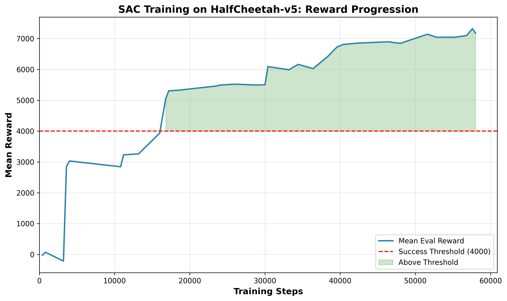
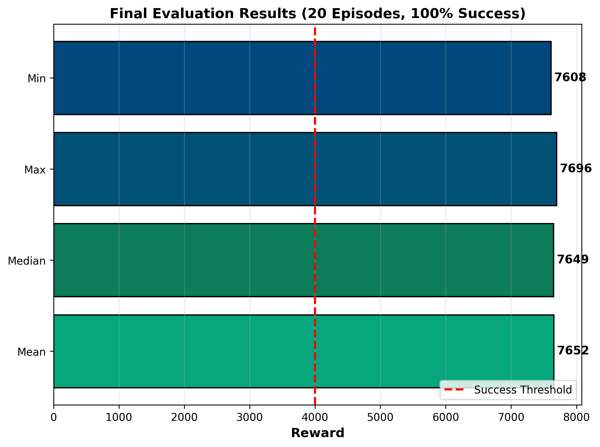

# RL Locomotion Control: SAC on MuJoCo HalfCheetah-v5

I built a reinforcement learning project implementing **Soft Actor-Critic (SAC)** for continuous locomotion control on the MuJoCo HalfCheetah-v5 environment. It features end-to-end RL pipeline with vectorized environments, experiment tracking via Weights & Biases, and comprehensive evaluation.

---

## Project Highlights

- **Algorithm:** Soft Actor-Critic (SAC) — state-of-the-art off-policy RL for continuous control
- **Environment:** MuJoCo HalfCheetah-v5 (simulated 2D locomotion task)
- **Training:** 1M timesteps with 4 parallel environments on NVIDIA RTX 3060
- **Tracking:** Real-time experiment monitoring with Weights & Biases (W&B)
- **Results:** 100% success rate, mean reward 7,651.5 (threshold: 4,000)

---

## Results

### Final Evaluation Metrics (20 Episodes)
| Metric          | Value      |
|-----------------|------------|
| **Mean Reward** | 7,651.50   |
| **Std Reward**  | 23.41      |
| **Success Rate**| 100.0%     |
| **Min Reward**  | 7,608.45   |
| **Max Reward**  | 7,695.85   |

### Training Performance
- **Total Training Time:** ~2 hours 25 minutes on RTX 3060 (6GB VRAM)
- **Training FPS:** ~320 steps/sec
- **Convergence:** Agent surpassed success threshold (4,000) by 200k steps

---

## Quick Start

### Prerequisites
```bash
# Python 3.8+, CUDA-enabled GPU recommended
pip install mujoco "gymnasium[mujoco]" stable-baselines3[extra] wandb
```

### Training
```bash
# Start training with default hyperparameters
python train.py

# Monitor progress at https://wandb.ai
```

### Evaluation
```bash
# Evaluate trained model over 20 episodes
python evaluate.py --episodes 20

# Render agent visually
python render.py
```

### Generate Plots
```bash
# Create visualization plots from W&B data
python plot_results.py
```

---

## Project Structure

```
rl-locomotion-control/
├── config.py           # Hyperparameters and configuration
├── train.py            # SAC training loop with W&B logging
├── evaluate.py         # Model evaluation and metrics
├── render.py           # Visual rendering of trained policy
├── plot_results.py     # Generate plots from W&B data
├── best_model/         # Best checkpoint (saved during training)
├── checkpoints/        # Periodic model checkpoints
└── plots/              # Generated visualization plots
```

---

## Algorithm: Soft Actor-Critic (SAC)

SAC is an off-policy actor-critic algorithm designed for continuous action spaces. Key features:
- **Maximum Entropy Framework:** Encourages exploration while optimizing rewards
- **Twin Critic Networks:** Reduces value overestimation bias
- **Automatic Entropy Tuning:** Adapts exploration-exploitation balance dynamically

**Why SAC for Locomotion?**
- Sample-efficient learning from off-policy replay buffer
- Robust to hyperparameter choices
- State-of-the-art performance on continuous control benchmarks

---

## Hyperparameters

| Parameter          | Value        |
|--------------------|--------------|
| Total Timesteps    | 1,000,000    |
| Parallel Envs      | 4            |
| Batch Size         | 256          |
| Learning Rate      | 3e-4         |
| Discount (γ)       | 0.99         |
| Soft Update (τ)    | 0.005        |
| Entropy Coef       | Auto-tuned   |

---

## Technical Stack

- **RL Framework:** Stable Baselines3 (PyTorch backend)
- **Simulation:** MuJoCo 3.4.0 + Gymnasium
- **Experiment Tracking:** Weights & Biases
- **Compute:** CUDA (NVIDIA RTX 3060)

---

## Visualizations

### Training Reward Curve


### Evaluation Results


---

## Learning Outcomes

This project demonstrates:
1. **Reinforcement Learning:** Hands-on implementation of SAC for continuous control
2. **MLOps:** Experiment tracking, hyperparameter logging, model checkpointing
3. **Parallel Training:** Efficient vectorized environment execution
4. **Evaluation Methodology:** Statistical analysis of trained policies

---

## Resources

- **W&B Project:** [View Live Training Dashboard](https://wandb.ai/made2806-university-of-colorado-boulder/rl-locomotion-halfcheetah)
- **MuJoCo Docs:** [https://mujoco.readthedocs.io](https://mujoco.readthedocs.io)
- **Stable Baselines3:** [https://stable-baselines3.readthedocs.io](https://stable-baselines3.readthedocs.io)
- **SAC Paper:** [Haarnoja et al., 2018](https://arxiv.org/abs/1801.01290)

---

## Citation

If you use this code in your work, please cite:
```
@misc{deshmukh2026rl,
  author = {Mandar Deshmukh},
  title = {RL Locomotion Control: SAC on MuJoCo HalfCheetah-v5},
  year = {2026},
  url = {https://github.com/Mandar117/RL-Locomotion-Control}
}
```

---

## Contact

**Mandar Deshmukh**  
University of Colorado Boulder  
Email: MandarMahesh.Deshmukh@colorado.edu  
LinkedIn: [linkedin.com/in/mandardeshmukh117](https://www.linkedin.com/in/mandardeshmukh117)